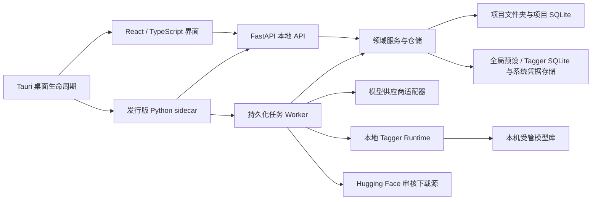

# 架构说明

## 设计原则

1. 文件夹是项目边界，业务数据不依赖应用安装目录或中央素材库。
2. 前端只表达交互，不直接操作数据集文件或拼接供应商请求。
3. 业务模块依赖抽象和数据模型，不依赖具体页面、HTTP 路由或供应商协议。
4. 长任务的每个条目都先持久化状态，再执行外部请求；进程意外结束后可以恢复。
5. 项目 SQLite 是标注的唯一活动来源；TXT / JSON 是明确导入或导出的边界格式，不参与运行时双写。
6. 已发布的数据库迁移不可修改；新版本只追加迁移。

## 运行结构

开发模式把 API 与 Worker 分开运行，便于观察和热更新；发行模式把两者放在同一个自包含 sidecar 中。两种模式使用相同服务和仓储，没有第二套业务实现。

## 桌面生命周期

Windows 主窗口的关闭请求只隐藏窗口，不销毁 WebView，也不停止正在运行的任务；托盘左键和“打开 Dataset Studio”菜单会恢复并聚焦同一个窗口。托盘“退出”先唤醒窗口，再由前端统一检查未保存内容、不可中断的文件写入和可安全停止的后台任务，检查通过后才请求 Tauri 退出。Linux 不假定桌面环境一定显示托盘图标，关闭窗口会直接进入同一套安全退出检查；托盘创建失败也不会阻止应用启动。发行版 sidecar 仍只在应用收到真正的 `RunEvent::Exit` 时终止。

应用启用单实例保护。用户在窗口隐藏期间再次启动程序时，新实例不会创建第二套 UI 或争用本地 API 端口，而是恢复已有主窗口。

## 后端模块边界

- `modules/workspaces`：项目清单、路径解析、可携带身份和设置。
- `modules/assets`：图片发现、增量索引、目录投影、缩略图、元数据读取，以及素材文件包的可恢复删除。
- `modules/annotations`：多通道文档、不可变修订、结构化 Tags、可用性、人工复核、旧 TXT 一次性导入和轻量校验。
- `modules/translations`：数据库译文通道、当前可用源修订追踪、结构校验和翻译 Prompt 模板渲染。
- `modules/prompts`：User Prompt、选定 JSON 字段和可选当前可用 Tags 的纯函数组合。
- `modules/presets`：全局 System Prompt / 模型连接聚合的持久化；API 密钥通过 `SecretStore` 隔离。
- `modules/providers`：供应商协议类型、单模型参数、统一 `ModelProvider` 协议、各供应商适配器，以及惰性共享的 Codex Runtime。
- `modules/taggers`：本地模型适配器注册、受管安装、完整性清单、审核下载计划、全局下载队列、可复用打标配置与惰性 ONNX Runtime；不依赖页面或项目任务仓储。
- `modules/jobs`：标注/翻译任务创建、通用执行后端与配置快照、查询投影、原子认领、尝试记录、单图调用追踪和 Worker。
- `modules/preprocessing`：计划、图像渲染、恢复记录和撤销编排。
- `modules/exports`：通道与修订快照、TXT / JSON 物化计划、目标冲突检查、持久化进度和可停止/继续的 Worker。
- `modules/statistics`：只读派生统计；当前实现为标签频次分析器。
- `api/routes`：HTTP 输入输出映射，不承载业务规则。
- `core`：原子文件、SQLite、迁移和时间等稳定基础能力。

依赖方向是 `API / entrypoints -> modules -> core`。供应商代码不能反向进入任务仓储，页面也不能理解 OpenRouter 或 Gemini 的请求 JSON。

## 数据库标注存储

`annotation_documents` 按“素材 + 通道 + 语言”定义逻辑文档，
`annotation_document_revisions` 保存不可变修订；文本和 Tags 分别进入
`annotation_text_contents` 与 `annotation_tag_items`。文档只保存当前 head 和已人工复核 revision
指针，删除使用墓碑修订。生成修订还通过 `annotation_revision_inputs` 记录所依赖的 Tag 或翻译源修订。

固定通道为“原有标注”、`Tags`、`LLM 描述` 和按语言区分的“翻译”。Tagger 只写 Tags，
远端标注模型只写 LLM 描述，翻译器只写目标语言通道；协议适配器不理解通道仓储，通道服务也不依赖具体模型。
可用性由当前 head 的校验状态、墓碑状态和图片内容哈希决定；人工复核由 `reviewed_revision_id` 独立表达。
因此 Tagger、LLM 描述和译文结果即使默认尚未复核，只要校验通过并匹配当前图片就可立即参与下游流程。
普通复核只移动 reviewed 指针，图片变化后的复核才复制内容到绑定当前图片哈希的新修订；复核不会覆盖校验结果。
批量操作先按所选素材聚合当前活动文档，再用“通道 + 语言”的显式目标一次提交；复核和删除都在取得全部目标租约后
以单个 SQLite 事务写入，避免前端逐通道循环造成部分成功。“原有标注”和各语言译文只有实际存在时才进入范围响应。

数据库迁移首次启用该存储时，扫描当时实际存在的旧 TXT 并导入保留名称的通道。迁移前 SQLite
备份进入项目 `history/`；无效 UTF-8 同时保留原始字节，确保以后仍可原样导出。导入完成后应用不再扫描外部
TXT 作为活动状态，也不删除旧文件。

任务创建会在同一个 SQLite 事务内冻结目标通道的 base revision。项目提示词设置启用 Tags 辅助 LLM 时，还逐图
冻结当时通过校验且匹配当前图片的 Tag head revision；Worker 只从该修订读取 Tag 名称，并在 JSON 元数据之后以可预览的 `tags: [...]`
行追加到 User Prompt。后续编辑 Tags 不会改变既有任务，也不会把 LLM 结果写回 Tags 通道。

## 模型连接与执行快照

模型连接是一个聚合，不是一次请求模板：

- 连接级字段只保存供应商协议、API 地址、凭据引用和连接总并发数。
- `provider_model_configs` 子表按连接和模型 ID 保存温度、输出上限、超时、Top P、随机种子及协议专属参数。
- 默认模型只负责新建任务时的初始选择，不共享或覆盖其它模型的参数。
- 协议专属参数使用带 `provider_type` 判别字段的严格联合类型；OpenRouter、OpenAI 兼容、OpenCode Go、Gemini 与 Codex 不能互相携带无效字段。

创建任务时，`PresetService` 把选中的单模型配置解析为版本化
`ProviderExecutionProfile`。项目数据库只保存这份单模型执行快照，Worker 和供应商适配器均从快照读取请求参数，
因此之后修改连接、默认模型或其它模型都不会改变已创建任务。旧任务快照由
`modules/jobs/provider_snapshot.py` 在读取时兼容转换，不原地改写项目历史。

任务表以 `execution_backend` 区分远端 `provider` 与 `local_tagger`，并把具体执行配置写入统一的
`execution_snapshot`。旧项目迁移时会把已有供应商字段回填为通用执行字段，原供应商快照仍保留用于兼容；
本地 Tagger 任务不需要 Prompt、API 凭据或网络请求，翻译任务则继续强制使用供应商后端。

OpenAI 兼容连接通过标准 `GET {base_url}/models` 拉取目录，并在本地按模型 ID、名称和描述搜索。
标准目录通常不声明输入模态、参数或推理档位，界面会明确标记能力未知，且不会把缺失元数据解释为不支持。
OpenRouter 目录仍使用其扩展元数据；两个协议各自由适配器映射推理参数，不共享供应商请求 JSON。

## 前端模块边界

- `pages` 负责页面编排，每个大页面拆分为局部组件和局部样式。
- `features/*/api.ts` 是资源级 API，`hooks.ts` 负责 React Query 缓存与失效。
- `shared/api` 只包含传输和共享 DTO；`shared/desktop` 隔离 Tauri 能力。
- Zustand 只保存短生命周期的界面选择，不复制后端持久状态。

图片列表使用虚拟化，面向 2,000 余项仍只渲染可见行。页面使用按路由懒加载，工作区编辑器不会拖慢项目首页启动。

素材页保持两类选择状态分离：`selectedAssetId` 只表示编辑器当前打开的图片，
`checkedAssetIds` 只表示跨列表页保留的批量操作范围。目录树是后端索引的只读投影，选中目录只给素材查询和
“全选当前筛选”增加子树边界，不会隐式清空或改写批量选择。
“标记已复核”和“删标注”都会先打开共享的类别选择层；若当前编辑器的对应通道存在未保存草稿，该类别会暂时禁用，
其它类别仍可独立执行。

## 素材删除与目录边界

工作区仍以用户打开的顶层文件夹为唯一项目边界。目录接口从当前 `is_present` 索引派生父子关系和直属/后代数量，
不在磁盘上维护第二份目录清单；目录筛选使用规范化的 POSIX 相对路径和 `目录/%` 边界，避免把 `foo` 错配到
`foobar`。

标注删除只为所选数据库通道写入墓碑修订，不删除迁移来源 TXT。逻辑输出租约使用
“素材 ID + 通道 + 语言”，所以同名图片不再共享标注写入资源，Tags、LLM 描述和译文也不会互相阻塞或覆盖。

素材删除位于 `modules/assets/deletions`，采用“预览计划 -> 文件恢复清单 -> 顺序移动 -> SQLite 提交”的协议：

- 删除单位是图片及其可独占的旧 TXT、旧语言旁车和同名 `.json`；共享伴随文件保留并在预览中提示。
- 预览令牌覆盖素材 ID、相对路径、文件哈希、大小和修改时间；执行时重新规划并逐文件校验。
- 文件先移入 `.annotation-workspace/recovery/deletions/<operation-id>/files/`，成功后只把索引标记为不在场，
  不删除用户的空目录。
- 撤销先检查原位置没有新同名文件并验证恢复文件哈希，再恢复全部文件和索引；失败会逆序补偿。
- 运行、撤销和恢复状态持久化到项目 SQLite。Worker 启动时会恢复中断操作；素材删除与扫描、预处理、
  导出、标注/翻译任务通过工作区锁和持久化状态双重互斥。

## 本地 Tagger 模型库

本地模型是全局资源，不写入数据集目录。默认模型库为应用数据目录下的 `models/taggers/`，用户可以在
“设置 → 本地打标器”中把空模型库切换到明确选择的绝对路径。导入操作先由适配器校验源目录，再把受管文件
复制到 `.staging/`，在复制过程中计算 SHA-256，写入版本化 `installation.json` 后原子提升为正式安装。
模型列表的日常读取只比较清单中的路径、大小和修改时间；显式“完整校验”会重新解析模型并计算全部文件哈希。

设置页的“Hugging Face 下载”只展示适配器内置的审核计划。每个计划固定 40 位 commit revision、精确远端路径、
目标相对路径、文件大小、SHA-256、许可证标识和条款链接；用户明确确认模型许可证后才能创建下载任务。
下载器不会递归拉取仓库或猜测目录结构。全局 SQLite 保存下载计划快照和
队列状态，Worker 同一时间只传输一个模型。文件进入模型库内的 `.downloads/<task-id>/`，支持暂停、失败和进程
中断后的续传；全部文件再次校验并通过适配器验证后，`payload/` 才会原子提升为正式安装。已存在且文件集合完全
匹配的本地安装会被识别为同一审核版本，不会重复下载。

Hugging Face Token 保存在系统凭据库；解析顺序为应用凭据、`HF_TOKEN`、本机 Hugging Face 登录和匿名访问。
Linux Secret Service 不可用时不会降级为明文存储，界面会显示诊断，同时仍允许 `HF_TOKEN`、本机登录和环境
代理工作。代理支持跟随环境变量、自定义 HTTP(S) 地址和明确直连，自定义地址同样存放在系统凭据库。下载清单和任务表不
保存 Token 或代理凭据。当前适配器覆盖 CL Tagger v2、WD Tagger v3、PixAI Tagger v0.9、JoyTag、
AnimeTimm DBv4 与 Camie Tagger v2，且各自拥有独立的目录契约与下载计划。

每个安装可以建立多份全局配置，独立保存阈值、输出类别、执行设备和批大小。创建任务时会冻结安装指纹与完整
配置；模型文件后来发生变化时，旧任务不会静默改用新权重，而是拒绝执行并要求重新创建任务。

Runtime 只在 Worker 真正处理本地任务时加载 ONNX Session，并用单项 LRU 约束常驻大模型数量。源码依赖把
`onnxruntime` CPU 与 `onnxruntime-gpu[cuda,cudnn]` 声明为互斥 extra；CPU 是便携默认值，CUDA 必须由用户
显式选择，因此两种 wheel 不会在同一环境并存。自动设备模式在 CUDA 环境中优先创建 CUDA + CPU 算子回退链；若 CUDA Session 因驱动或动态库问题无法初始化，
或在执行期间失效，则重建或切换为纯 CPU Session。显式选择 CUDA 时保持严格失败，不会把 CPU 降级伪装成
GPU 执行；DirectML 仍作为替代 Runtime 构建可用时的兼容设备。
单图产物仍进入统一的 `runs/` 追踪结构，其中保存阈值、类别、设备、标签置信度和推理耗时，不保存图片副本。

## 平台路径与应用数据

全局应用数据使用同一个 `DatasetAnnotationStudio` 目录名，并分别落在 Windows
`LocalAppData`、Linux XDG data home 和 macOS Application Support 下。后端诊断返回的实际目录是界面打开日志
位置时的首选真值，`DATASET_STUDIO_APP_DATA` 只接受用户显式提供的覆盖。

文件路径身份集中由 `core.paths` 决定：Windows 比较时忽略大小写，Linux 保留大小写。排序、面向 Windows
可携带性的重命名限制和扁平导出的大小写冲突检查仍可采用更严格规则，但素材身份、旁车归属、输出租约、删除计划
与最近项目不能再用无条件 `casefold()` 合并 Linux 上实际不同的文件。

## 单图调用追踪

Worker 在外部请求开始前写入项目 `runs` 目录中的脱敏请求快照，只保留 System/User
Prompt、模型和非敏感请求参数，不保存 API Key、图片 Base64 或绝对路径。供应商响应统一拆分为
可见推理、最终输出、Token 用量和原始响应；供应商未返回可见推理时不会把空值解释为“没有推理”。

素材页通过 `modules/jobs/traces.py` 按任务输出通道查找最终输出与当前数据库 head 完全一致的尝试，因此后续失败重试
不会覆盖当前标注的来源记录。旧版运行产物没有独立请求快照时，会从任务快照与当前元数据重建
Prompt，并在界面明确标记为重建结果。

## 扩展点

### 新数据源

新增导入来源应实现“发现候选文件 -> 规范化为工作区内文件”的独立入口，最终仍交给 `AssetScanner`。扫描器不感知下载器、压缩包或远端数据源。

### 新供应商

实现 `ModelProvider.complete()`，在工厂中注册 `ProviderType`，并为其编写无网络适配器测试。需要外部登录或长生命周期客户端的供应商，应把会话生命周期封装在独立 Runtime 中；任务、重试、保存和校验无需理解其认证协议。

OpenCode Go 适配器位于独立的 `modules/providers/opencode_go` 包。模型规格负责选择
Chat Completions 或 Anthropic Messages 通道、声明可用推理档位和缓存模式；实时模型目录
只与这份已审计规格取交集，未知模型不会回退到通用 OpenAI 兼容协议。两条传输实现只共享
供应商中立的请求、响应与图片编码工具，不导入其它供应商适配器的内部函数。

Codex 连接由官方 Python SDK 驱动：SDK 源码固定到 OpenAI `3f74f00295dcb1346340686bb09c5bfd4f0237c4` 提交，对应 CLI Runtime `0.144.4`，避免协议模型与运行时独立漂移。API 进程与 Worker 各自惰性维护一个 app-server，复用 Codex 自身缓存的 ChatGPT 登录。每张图片创建独立的临时 Thread，完成后丢弃；System Prompt 映射为 `developer_instructions`，最终 Assistant 回复原样进入统一的 `ProviderResponse.content`。标注任务支持到 `max` 推理强度；需要子代理的 `ultra` 不进入单图标注参数面。

### 新本地 Tagger

新增模型格式应实现独立 `TaggerAdapter`，负责检测目录、严格校验、读取标签词表和图像预处理，并在
`TaggerAdapterRegistry` 注册。适配器返回明确的受管文件集合；模型管理服务、任务快照、Runtime 缓存和前端配置
不需要理解模型仓库的原始布局。

若模型存在可公开复现的固定发布版本，适配器可以额外返回 `TaggerDownloadPlan`。计划必须声明完整 commit
revision、每个文件的远端/本地映射、大小与 SHA-256；`TaggerModelSource` 只负责把该不可变计划物化到私有
staging，统一安装器负责适配器验证、清单和原子发布。新增下载源应复用持久化任务与安装器边界，不能把仓库布局
推断、凭据处理或正式目录写入下沉到具体适配器。

### 新校验与统计

标注修订正文始终保持不变。校验器输出统一状态与问题列表；统计器消费当前可用的结构化 Tags 并产生只读投影。
其它正文分析器可以新增，但不能反向改写修订。

### 新预处理操作

先扩展不可变的预览计划，再实现原子渲染与恢复信息。任何会改文件的操作都必须满足：执行前可预览、原文件进入项目恢复区、失败自动回滚、成功后可逆序撤销。

图片解码、缩放与重新编码可以通过有界线程池写入操作私有的 staging 文件，但工作线程不得修改工作区正式路径或写 SQLite。最终文件替换、旁车文件迁移、资产索引更新和失败补偿始终由协调器按预览计划顺序执行。并发数属于执行期资源参数，不参与预览令牌或图片输出语义。

### 数据集导出

导出请求显式选择一个或多个通道、`current` 或 `reviewed` 修订策略，以及 TXT、JSON 或两者。默认使用当前 head；
`reviewed` 仅用于需要人工复核门槛的导出。预览解析并冻结具体
revision ID、结构化内容和目标路径；创建任务时重新规划，任一 revision 指针变化都会令预览失效，即使新旧正文相同。
图片缺失或变化、目标目录非空以及最终目标名称冲突属于不可绕过错误；通道缺失、过期、空内容、结构异常或
非 UTF-8 属于警告，尚未人工复核本身不阻止默认导出。

单通道 TXT 物化为常见的扁平图片 + 同名 TXT。多通道 TXT 为每个通道建立独立训练集目录并复制对应图片，避免把
Tags 与描述合并成含义不清的文本；逐图 JSON 可以在一个对象中保留多个通道、revision ID 和结构化 Tags。
任务、条目、停止点、冻结 payload 和恢复状态全部保存在源项目的 `state.sqlite3`；继续任务前会校验已完成文件，
避免覆盖用户后来修改的内容。

## 持久化与升级

全局数据库和每个项目数据库都有独立的 `schema_migrations`。迁移按版本连续执行并校验 SHA-256；修改旧迁移会拒绝启动，从而避免静默破坏旧项目。API 与 Worker 每个进程首次取得工作区时都会确认迁移已经完成，并在 SQLite 写锁内重新检查版本，避免两个进程同时启动时重复应用迁移。项目清单也有独立 `schema_version`，供未来非 SQLite 格式升级使用。
