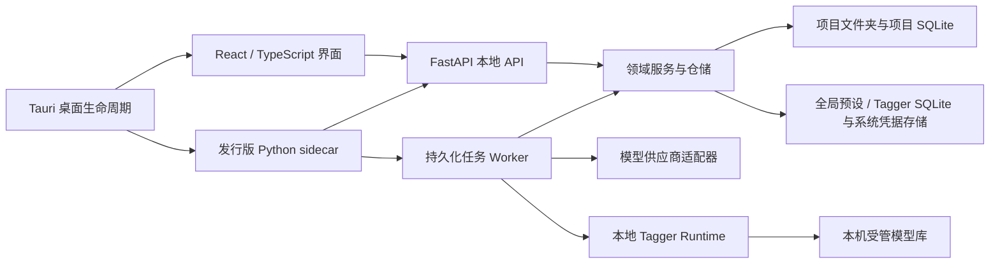

# 架构说明

## 设计原则

1. 文件夹是项目边界，业务数据不依赖应用安装目录或中央素材库。
2. 前端只表达交互，不直接操作数据集文件或拼接供应商请求。
3. 业务模块依赖抽象和数据模型，不依赖具体页面、HTTP 路由或供应商协议。
4. 长任务的每个条目都先持久化状态，再执行外部请求；进程意外结束后可以恢复。
5. 当前标注保持训练可直接使用的原始文本，解析和统计属于可替换的观察器，不改写标注正文。
6. 已发布的数据库迁移不可修改；新版本只追加迁移。

## 运行结构

开发模式把 API 与 Worker 分开运行，便于观察和热更新；发行模式把两者放在同一个自包含 sidecar 中。两种模式使用相同服务和仓储，没有第二套业务实现。

## 后端模块边界

- `modules/workspaces`：项目清单、路径解析、可携带身份和设置。
- `modules/assets`：图片发现、增量索引、缩略图和元数据读取。
- `modules/annotations`：原文保存、删除、历史以及轻量校验。
- `modules/translations`：多语言译文旁车、源版本追踪、结构校验和翻译 Prompt 模板渲染。
- `modules/prompts`：User Prompt 与选定 JSON 字段的纯函数组合。
- `modules/presets`：全局 System Prompt / 模型连接聚合的持久化；API 密钥通过 `SecretStore` 隔离。
- `modules/providers`：供应商协议类型、单模型参数、统一 `ModelProvider` 协议、各供应商适配器，以及惰性共享的 Codex Runtime。
- `modules/taggers`：本地模型适配器注册、受管安装、完整性清单、可复用打标配置与惰性 ONNX Runtime；不依赖页面或任务仓储。
- `modules/jobs`：标注/翻译任务创建、通用执行后端与配置快照、查询投影、原子认领、尝试记录、单图调用追踪和 Worker。
- `modules/preprocessing`：计划、图像渲染、恢复记录和撤销编排。
- `modules/exports`：导出范围快照、活动标注校验、扁平文件名冲突检查、持久化进度和可停止/继续的复制 Worker。
- `modules/statistics`：只读派生统计；当前实现为标签频次分析器。
- `api/routes`：HTTP 输入输出映射，不承载业务规则。
- `core`：原子文件、SQLite、迁移和时间等稳定基础能力。

依赖方向是 `API / entrypoints -> modules -> core`。供应商代码不能反向进入任务仓储，页面也不能理解 OpenRouter 或 Gemini 的请求 JSON。

## 模型连接与执行快照

模型连接是一个聚合，不是一次请求模板：

- 连接级字段只保存供应商协议、API 地址、凭据引用和连接总并发数。
- `provider_model_configs` 子表按连接和模型 ID 保存温度、输出上限、超时、Top P、随机种子及协议专属参数。
- 默认模型只负责新建任务时的初始选择，不共享或覆盖其它模型的参数。
- 协议专属参数使用带 `provider_type` 判别字段的严格联合类型；OpenRouter、OpenAI 兼容、OpenCode Go、Gemini 与 Codex 不能互相携带无效字段。

创建任务时，`PresetService` 把选中的单模型配置解析为版本化
`ProviderExecutionProfile`。项目数据库只保存这份单模型执行快照，Worker 和供应商适配器均从快照读取请求参数，
因此之后修改连接、默认模型或其它模型都不会改变已创建任务。旧任务快照由
`modules/jobs/provider_snapshot.py` 在读取时兼容转换，不原地改写项目历史。

任务表以 `execution_backend` 区分远端 `provider` 与 `local_tagger`，并把具体执行配置写入统一的
`execution_snapshot`。旧项目迁移时会把已有供应商字段回填为通用执行字段，原供应商快照仍保留用于兼容；
本地 Tagger 任务不需要 Prompt、API 凭据或网络请求，翻译任务则继续强制使用供应商后端。

OpenAI 兼容连接通过标准 `GET {base_url}/models` 拉取目录，并在本地按模型 ID、名称和描述搜索。
标准目录通常不声明输入模态、参数或推理档位，界面会明确标记能力未知，且不会把缺失元数据解释为不支持。
OpenRouter 目录仍使用其扩展元数据；两个协议各自由适配器映射推理参数，不共享供应商请求 JSON。

## 前端模块边界

- `pages` 负责页面编排，每个大页面拆分为局部组件和局部样式。
- `features/*/api.ts` 是资源级 API，`hooks.ts` 负责 React Query 缓存与失效。
- `shared/api` 只包含传输和共享 DTO；`shared/desktop` 隔离 Tauri 能力。
- Zustand 只保存短生命周期的界面选择，不复制后端持久状态。

图片列表使用虚拟化，面向 2,000 余项仍只渲染可见行。页面使用按路由懒加载，工作区编辑器不会拖慢项目首页启动。

## 本地 Tagger 模型库

本地模型是全局资源，不写入数据集目录。默认模型库为应用数据目录下的 `models/taggers/`，用户可以在
“设置 → 本地打标器”中把空模型库切换到明确选择的绝对路径。导入操作先由适配器校验源目录，再把受管文件
复制到 `.staging/`，在复制过程中计算 SHA-256，写入版本化 `installation.json` 后原子提升为正式安装。
模型列表的日常读取只比较清单中的路径、大小和修改时间；显式“完整校验”会重新解析模型并计算全部文件哈希。

首个适配器 `cl_tagger_v2` 采用严格、失败关闭的文件契约：要求 `model.onnx`、
`model.onnx.data`、`model_vocabulary.json` 与 `model_metadata.json`，校验 `pixel_values`
输入、`logits` 输出、384×384 float32 张量、标签数量和外部权重位置。每个安装可以建立多份全局配置，独立保存
阈值、输出类别、执行设备和并发数。创建任务时会冻结安装指纹与完整配置；模型文件后来发生变化时，旧任务不会
静默改用新权重，而是拒绝执行并要求重新创建任务。

Runtime 只在 Worker 真正处理本地任务时加载 ONNX Session，并用单项 LRU 约束常驻大模型数量。标准发行依赖
CPU 版 ONNX Runtime；若运行环境提供 CUDA 或 DirectML provider，配置界面会按运行时探测结果开放对应设备。
单图产物仍进入统一的 `runs/` 追踪结构，其中保存阈值、类别、设备、标签置信度和推理耗时，不保存图片副本。

## 单图调用追踪

Worker 在外部请求开始前写入项目 `runs` 目录中的脱敏请求快照，只保留 System/User
Prompt、模型和非敏感请求参数，不保存 API Key、图片 Base64 或绝对路径。供应商响应统一拆分为
可见推理、最终输出、Token 用量和原始响应；供应商未返回可见推理时不会把空值解释为“没有推理”。

素材页通过 `modules/jobs/traces.py` 查找最终输出与当前 `.txt` 完全一致的尝试，因此后续失败重试
不会覆盖当前标注的来源记录。旧版运行产物没有独立请求快照时，会从任务快照与当前元数据重建
Prompt，并在界面明确标记为重建结果。

## 扩展点

### 新数据源

新增导入来源应实现“发现候选文件 -> 规范化为工作区内文件”的独立入口，最终仍交给 `AssetScanner`。扫描器不感知下载器、压缩包或远端数据源。

### 新供应商

实现 `ModelProvider.complete()`，在工厂中注册 `ProviderType`，并为其编写无网络适配器测试。需要外部登录或长生命周期客户端的供应商，应把会话生命周期封装在独立 Runtime 中；任务、重试、保存和校验无需理解其认证协议。

OpenCode Go 适配器位于独立的 `modules/providers/opencode_go` 包。模型规格负责选择
Chat Completions 或 Anthropic Messages 通道、声明可用推理档位和缓存模式；实时模型目录
只与这份已审计规格取交集，未知模型不会回退到通用 OpenAI 兼容协议。两条传输实现只共享
供应商中立的请求、响应与图片编码工具，不导入其它供应商适配器的内部函数。

Codex 连接由官方 Python SDK 驱动：SDK 源码固定到 OpenAI `3f74f00295dcb1346340686bb09c5bfd4f0237c4` 提交，对应 CLI Runtime `0.144.4`，避免协议模型与运行时独立漂移。API 进程与 Worker 各自惰性维护一个 app-server，复用 Codex 自身缓存的 ChatGPT 登录。每张图片创建独立的临时 Thread，完成后丢弃；System Prompt 映射为 `developer_instructions`，最终 Assistant 回复原样进入统一的 `ProviderResponse.content`。标注任务支持到 `max` 推理强度；需要子代理的 `ultra` 不进入单图标注参数面。

### 新本地 Tagger

新增模型格式应实现独立 `TaggerAdapter`，负责检测目录、严格校验、读取标签词表和图像预处理，并在
`TaggerAdapterRegistry` 注册。适配器返回明确的受管文件集合；模型管理服务、任务快照、Runtime 缓存和前端配置
不需要理解模型仓库的原始布局。

远端下载在首版中没有路由、实现或界面入口。`modules/taggers/sources` 仅保留不可变的
`TaggerDownloadPlan` / `TaggerModelSource` 边界；未来如接入 Hugging Face，必须由具体适配器声明固定 revision、
精确远端路径和目标相对路径，再复用现有 staging 与校验流程，不能递归下载未知仓库并猜测文件结构。

### 新校验与统计

标注正文始终保持不变。校验器输出统一状态与问题列表；统计器消费正文并产生派生索引。XML 标签统计只是将来的一个插件，不是核心数据模型。

### 新预处理操作

先扩展不可变的预览计划，再实现原子渲染与恢复信息。任何会改文件的操作都必须满足：执行前可预览、原文件进入项目恢复区、失败自动回滚、成功后可逆序撤销。

图片解码、缩放与重新编码可以通过有界线程池写入操作私有的 staging 文件，但工作线程不得修改工作区正式路径或写 SQLite。最终文件替换、旁车文件迁移、资产索引更新和失败补偿始终由协调器按预览计划顺序执行。并发数属于执行期资源参数，不参与预览令牌或图片输出语义。

### 数据集导出

导出预览从项目索引取得整个项目或界面所选素材，并重新读取当前图片与活动同名 `.txt`。图片缺失、版本变化、目标目录非空以及扁平化后的大小写不敏感同名冲突属于不可绕过错误；缺少标注、空文件、结构异常或非 UTF-8 标注属于警告，只有用户在二次确认中明确允许后才可创建任务。人工采用且文件版本未变化的异常标注视为已确认。

用户通过桌面原生目录选择器指定的空文件夹就是最终输出位置。Worker 按预览快照校验源文件版本与哈希，原样复制图片和当时存在的活动 `.txt`，不保留源目录层级，也不向目标目录写入清单、数据库或工作区子目录。任务、条目、停止点和恢复状态全部保存在源项目的 `state.sqlite3`；继续任务前会校验已完成文件，避免覆盖用户后来修改的内容。

## 持久化与升级

全局数据库和每个项目数据库都有独立的 `schema_migrations`。迁移按版本连续执行并校验 SHA-256；修改旧迁移会拒绝启动，从而避免静默破坏旧项目。API 与 Worker 每个进程首次取得工作区时都会确认迁移已经完成，并在 SQLite 写锁内重新检查版本，避免两个进程同时启动时重复应用迁移。项目清单也有独立 `schema_version`，供未来非 SQLite 格式升级使用。
