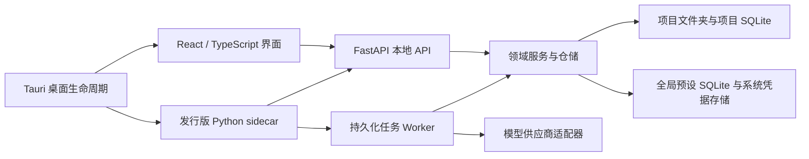

# 架构说明

## 设计原则

1. 文件夹是项目边界，业务数据不依赖应用安装目录或中央素材库。
2. 前端只表达交互，不直接操作数据集文件或拼接供应商请求。
3. 业务模块依赖抽象和数据模型，不依赖具体页面、HTTP 路由或供应商协议。
4. 长任务的每个条目都先持久化状态，再执行外部请求；进程意外结束后可以恢复。
5. 当前标注保持训练可直接使用的原始文本，解析和统计属于可替换的观察器，不改写标注正文。
6. 已发布的数据库迁移不可修改；新版本只追加迁移。

## 运行结构

开发模式把 API 与 Worker 分开运行，便于观察和热更新；发行模式把两者放在同一个自包含 sidecar 中。两种模式使用相同服务和仓储，没有第二套业务实现。

## 后端模块边界

- `modules/workspaces`：项目清单、路径解析、可携带身份和设置。
- `modules/assets`：图片发现、增量索引、缩略图和元数据读取。
- `modules/annotations`：原文保存、删除、历史以及轻量校验。
- `modules/prompts`：User Prompt 与选定 JSON 字段的纯函数组合。
- `modules/presets`：全局 System Prompt / 模型连接配置；API 密钥通过 `SecretStore` 隔离。
- `modules/providers`：统一 `ModelProvider` 协议、各供应商适配器，以及惰性共享的 Codex Runtime。
- `modules/jobs`：任务创建、查询投影、原子认领、尝试记录和 Worker。
- `modules/preprocessing`：计划、图像渲染、恢复记录和撤销编排。
- `modules/statistics`：只读派生统计；当前实现为标签频次分析器。
- `api/routes`：HTTP 输入输出映射，不承载业务规则。
- `core`：原子文件、SQLite、迁移和时间等稳定基础能力。

依赖方向是 `API / entrypoints -> modules -> core`。供应商代码不能反向进入任务仓储，页面也不能理解 OpenRouter 或 Gemini 的请求 JSON。

## 前端模块边界

- `pages` 负责页面编排，每个大页面拆分为局部组件和局部样式。
- `features/*/api.ts` 是资源级 API，`hooks.ts` 负责 React Query 缓存与失效。
- `shared/api` 只包含传输和共享 DTO；`shared/desktop` 隔离 Tauri 能力。
- Zustand 只保存短生命周期的界面选择，不复制后端持久状态。

图片列表使用虚拟化，面向 2,000 余项仍只渲染可见行。页面使用按路由懒加载，工作区编辑器不会拖慢项目首页启动。

## 扩展点

### 新数据源

新增导入来源应实现“发现候选文件 -> 规范化为工作区内文件”的独立入口，最终仍交给 `AssetScanner`。扫描器不感知下载器、压缩包或远端数据源。

### 新供应商

实现 `ModelProvider.complete()`，在工厂中注册 `ProviderType`，并为其编写无网络适配器测试。需要外部登录或长生命周期客户端的供应商，应把会话生命周期封装在独立 Runtime 中；任务、重试、保存和校验无需理解其认证协议。

Codex 连接由官方 Python SDK 驱动：SDK 源码固定到 OpenAI `3f74f00295dcb1346340686bb09c5bfd4f0237c4` 提交，对应 CLI Runtime `0.144.4`，避免协议模型与运行时独立漂移。API 进程与 Worker 各自惰性维护一个 app-server，复用 Codex 自身缓存的 ChatGPT 登录。每张图片创建独立的临时 Thread，完成后丢弃；System Prompt 映射为 `developer_instructions`，最终 Assistant 回复原样进入统一的 `ProviderResponse.content`。标注任务支持到 `max` 推理强度；需要子代理的 `ultra` 不进入单图标注参数面。

### 新校验与统计

标注正文始终保持不变。校验器输出统一状态与问题列表；统计器消费正文并产生派生索引。XML 标签统计只是将来的一个插件，不是核心数据模型。

### 新预处理操作

先扩展不可变的预览计划，再实现原子渲染与恢复信息。任何会改文件的操作都必须满足：执行前可预览、原文件进入项目恢复区、失败自动回滚、成功后可逆序撤销。

## 持久化与升级

全局数据库和每个项目数据库都有独立的 `schema_migrations`。迁移按版本连续执行并校验 SHA-256；修改旧迁移会拒绝启动，从而避免静默破坏旧项目。项目清单也有独立 `schema_version`，供未来非 SQLite 格式升级使用。
