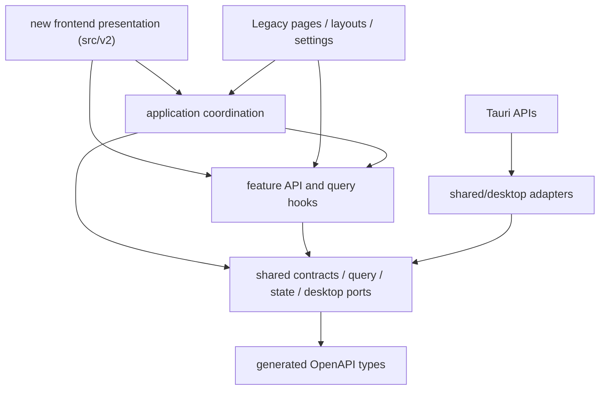

# 新前端架构边界（代码目录：`src/v2`）

本文只定义代码、运行和协作边界，不定义任何视觉语言。目标是让新前端与 Legacy UI 共享业务能力，
但不共享页面结构、组件体系、主题、CSS 或布局状态。

## 术语与命名

- **新前端**：当前产品默认入口承载的新一代表现层，可同时容纳多个独立视觉方案。
- **`src/v2`**：新前端的代码代际目录，只表示依赖边界；不得用 `V2` 代称某个视觉方案。
- **`dial-archive`**：当前默认首页方案 ID，由已确认的断环档案仪原型演进而来；方案私有实现使用
  `dial-archive-*` 类名和 `--dial-archive-*` CSS 变量。
- **Legacy**：位于 `frontend/Legacy`、通过 `legacy.html` 访问的旧表现层。

## 双入口策略

- `index.html -> src/main.tsx -> src/frontend-main.tsx` 是新前端的产品默认入口，加载视觉中立的
  `FrontendApp` 与首页方案宿主。
- `legacy.html -> Legacy/main.tsx` 是稳定的旧界面入口，路径与 HashRouter 可以组合为
  `/legacy.html#/workspace/<project-id>`。
- 只有 `Legacy/main.tsx` 可以加载 `Legacy/styles/global.css`、旧主题初始化与旧界面根组件。
  新前端入口不得导入这条链，因此构建时不会继承旧 CSS。
- 两个 HTML 都由 Vite 构建并进入 Tauri 的 `frontendDist`；切换界面体系应执行整页导航，
  不在同一个 DOM 中热切换全局样式。

当前目录边界如下：

```text
frontend/
├─ Legacy/              # 旧页面、布局、设置、主题、UI、样式与 UI 测试
├─ legacy.html          # 稳定兼容入口
└─ src/
   ├─ main.tsx          # 默认入口桥接到 frontend-main
   ├─ frontend-main.tsx # 新前端挂载、通用 reset 与宿主样式
   ├─ application/      # UI 无关的工作流编排
   ├─ features/         # API 与查询适配
   ├─ shared/           # 契约、状态、格式与通用桌面端口
   └─ v2/
      ├─ app/                       # 新前端根组件与运行时错误恢复
      ├─ navigation/                # 跨方案稳定的信息架构
      ├─ pages/home/
      │  ├─ HomeVariantHost.tsx     # 按 URL 选择首页方案
      │  ├─ homeVariantRegistry.ts  # 自动发现独立方案目录
      │  └─ variants/<variant-id>/  # 每个视觉方案的私有实现、样式与测试
      └─ styles/                    # 仅含中立 reset 与宿主状态样式
```

## 首页视觉方案边界

`src/v2` 只表示新一代前端代码边界，不代表任何具体视觉语言。当前默认方案 `dial-archive` 的组件、
`dial-archive-*` 类名、`--dial-archive-*` 令牌、动效与测试全部位于
`v2/pages/home/variants/dial-archive/`。

其它模型或设计方向在 `variants/<variant-id>/index.tsx` 默认导出自己的页面组件即可，由
`import.meta.glob("./variants/*/index.tsx")` 自动发现，不需要共同修改中央清单。`variant-id` 只允许
小写字母、数字和连字符。使用 `/?home=<variant-id>` 独立加载和比较；未知 ID 回退到默认方案。

当前默认 ID 是 `dial-archive`，但“当前默认”不代表“通用模板”。改变
`DEFAULT_HOME_VARIANT_ID` 属于共享产品决策，应与某个方案的视觉实现分开评审和提交。通用宿主只负责
加载、错误恢复与稳定信息架构，不提供配色、字体、几何或动效主题。

## 多模型文件所有权

每个视觉方案只拥有自己的 `variants/<variant-id>/` 目录。新增方案时应直接建立新目录，不复制或改写
现有方案来伪装成通用基础层。以下文件是共享契约：

- `navigation/spaceRegistry.ts`：一级空间的稳定 ID、名称、顺序与语义。
- `HomeVariantHost.tsx`、`homeVariantRegistry.ts`：方案发现、选择和回退协议。
- `app/`、`styles/reset.css`、`styles/shell.css`：视觉中立的入口与恢复层。
- `src/application`、`src/features`、`src/shared`：业务编排、API、状态和桌面端口。
- `frontend/Legacy` 与 `legacy.html`：旧界面的稳定退路。

需要改动共享契约时，必须说明所有受影响方案，并将共享改动与单个方案的视觉改动拆成可独立审阅的
差异。只有出现至少两个已确认的真实使用方后，才从方案目录提取共享视觉组件；不得为了假想复用预建
全局组件库、动效层或主题令牌。

## 交互与样式基础规则

- 方案必须拥有唯一根类、类名前缀和 CSS 变量前缀；样式从方案入口导入，不写无范围选择器。
- React 状态可以记录当前预览/选中空间，但悬浮抬升使用原生 `:hover` / `:focus-visible`，不得依赖
  高频 React 重渲染追赶鼠标，也不得让持久 `data-active` 状态维持浮起。
- 可移动卡片必须拆成**固定语义命中层**与**可动视觉层**。承接悬停、点击、焦点和键盘事件的外层
  不得设置位移或裁切；内部视觉层负责 `transform`、`clip-path`、阴影与动效，并使用
  `pointer-events: none`，防止快速扫动时命中区从指针下移走。
- 同类可用入口必须获得一致的瞬时反馈；禁用项不得误触发悬浮线、抬升或可点击光标。
- 方案内 DOM 查询限制在根节点 `ref`，禁止用全局 `document.querySelector` 寻找实例内部元素。
- 指针位置等高频输入通过 `requestAnimationFrame` 合并后写入方案私有 CSS 变量；卸载、离开和失焦时
  必须复位并取消未完成帧。
- SVG `defs`、DOM ID 与其它跨实例标识使用 React `useId()` 生成实例唯一前缀。
- 所有动效支持 `prefers-reduced-motion`，且关闭动效后仍保留清楚的焦点、选中和禁用状态。

## 依赖方向



约束由 `frontend/scripts/check-architecture.mjs` 执行：

1. `shared` 不得依赖应用、功能或任何界面层。
2. 一个 `feature` 不得导入另一个 `feature`，也不得依赖主题、弹窗、设置或桌面实现。
3. `application` 只协调功能与共享能力，不得导入 Legacy 或新前端页面。
4. 只有 `src/shared/desktop` 与 Legacy 自己的 `Legacy/shared/desktop` 边界可以直接导入
   `@tauri-apps/*`；新前端只能使用前者。
5. 只有 `shared/api/client.ts` 可以直接调用 `fetch`。
6. 新前端不得导入 `frontend/Legacy` 下的页面、布局、设置、主题、UI 或样式。
7. 所有 TypeScript 内部依赖必须保持无环。

## API 契约

FastAPI 的 `app.openapi()` 是传输契约的唯一来源：

```text
FastAPI schema
  -> frontend/openapi/openapi.json
  -> shared/api/generated/schema.ts
  -> shared/api/contracts/* compatibility aliases
  -> features/*/api.ts
  -> Legacy UI and new frontend
```

- `pnpm --dir frontend api:generate` 更新 OpenAPI 快照与 TypeScript 类型。
- `pnpm --dir frontend api:check` 只检查漂移，不修改文件，并已进入前端总检查。
- `contracts/*` 保留稳定的前端命名，但响应 DTO 均从生成类型派生，不再重复手写字段。
- `ApiOutput` 将 FastAPI 响应中会被默认序列化的字段递归标为必有；请求模型继续使用
  原始 OpenAPI 可选性。少数 UI 专用输入子集必须以 `Pick` / `Omit` 从生成类型派生。
- `features/*/api.ts` 继续作为语义适配层，页面不得拼接 URL 或供应商请求。

## 查询缓存与工作区投影

所有项目内查询使用统一前缀：

```text
["workspace-data", projectId, scope, ...detail]
```

`shared/query/workspaceQueries.ts` 同时定义 scope、键工厂与业务变更对应的失效集合。例如一次标注写入
会失效标注、历史、调用追踪、Prompt 预览、翻译、素材、工作区摘要和统计；调用方只声明
`annotation-written`，不再跨功能导入八套 query key。

全局资源（预设、Tagger、Tag 词典、系统诊断）保留独立键空间。需要影响所有已打开项目的全局设置，
通过按 scope 的 predicate 失效，而不是依赖某个功能的 `all` 键。

## 桌面能力与共享状态

- 原生窗口、对话框、事件、文件 URL 与 Tauri command 都封装在 `shared/desktop`。
- 安全退出编排位于 `application/useCloseGuard.ts`，依赖任务 API、未保存状态和桌面端口；
  两套 UI 复用同一退出协议。
- 批量素材选择位于 `workspaceSelectionStore.ts`，按项目切换时清空。
- 未保存修改位于 `unsavedChangesStore.ts`，不再与旧工作区布局状态共用 Store。
- 新前端可以复用这两个明确的状态能力，也可以在不影响退出协议的前提下为自己的页面建立局部视图状态。

## 已提取的行为控制器

新前端所需的核心工作流已经从 Legacy 页面提取到 `src/application`：

1. `workspace` 负责素材查询、筛选、分页、`selected` / `checked` 双选择、目录切换保护、
   批量标注入口以及可恢复素材删除状态。
2. `annotations` 负责标注草稿、并发保存回包协调、历史恢复、复核、删除、批量操作，
   以及 Tags 与本地词典译文的联合保存。
3. `tags` 负责 Tag 元数据保留、词典与 Tagger 词表补全、重复项处理和来源词库选择；
   Legacy 组件只保留键盘、焦点、字号滚轮和 DOM 选区适配。
4. `translations` 提供翻译对照文档模型、Token 输入投影和跨视图联动状态；滚动高度测量、
   ClipboardEvent 与 CodeMirror 仍由各表现层适配。
5. `jobs`、`preprocessing` 与 `exports` 负责表单状态、请求快照、可执行性判断、任务动作、
   预览指纹、停止/恢复和错误投影。

架构检查额外锁定这些已接入控制器的页面：不得重新直接导入 `features/*/hooks.ts` 或
`features/*/api.ts`。新前端可以复用控制器或其中的纯投影函数，不需要渲染任何旧组件。

`Legacy/layouts/workspace/WorkspaceTopbar`、`NavigationRail`、旧设置中心和旧主题系统继续属于 Legacy
表现层。除非某段行为确实需要被新前端复用，否则不为了“代码整洁”继续重构它们；这样可以避免把旧布局
抽象成新体系的隐性框架。

## 其他模型接手顺序

1. 先阅读本文、`pages/home/README.md`、`spaceRegistry.ts` 和当前方案目录，不从 Legacy 页面猜测新首页
   信息架构。
2. 执行 `git status --short`，确认工作区中已有修改的所有权；不得覆盖其它模型或用户的未提交文件。
3. 为新设计分配唯一 `variant-id`，只新增 `variants/<variant-id>/`，通过
   `/?home=<variant-id>` 预览。不要先改默认 ID，也不要删除其它方案。
4. 在方案目录内完成根组件、私有组件、Hooks、样式、动效和测试；只有确定缺失共享业务能力时，才提出
   独立的共享契约改动。
5. 先运行方案范围测试和真实交互检查，再运行全量前端门槛。JSDOM 行为测试不能替代浏览器中的
   `:hover` 命中、裁切、层叠和动效验证。
6. 交接时明确记录方案 ID、预览 URL、修改文件、共享契约改动、已运行检查、已知问题和是否已提交；
   不以“测试通过”代替视觉结论。

## 合入门槛

开发中优先运行范围检查：

- `pnpm --dir frontend exec vitest run src/v2`
- `pnpm --dir frontend check:architecture`
- `pnpm --dir frontend exec tsc -b --pretty false`

交付或提交前至少通过：

- `pnpm --dir frontend api:check`
- `pnpm --dir frontend check:architecture`
- `pnpm --dir frontend check`
- `pnpm --dir frontend build`
- `git diff --check`

当抽取涉及桌面生命周期或后端契约时，再追加 Rust 与后端对应测试；纯表现层不得反向要求后端改动。
视觉方案还必须在目标分辨率中检查默认、悬停、键盘焦点、减少动态和快速跨模块扫动；截图、临时浏览器
配置和构建产物不得提交。
