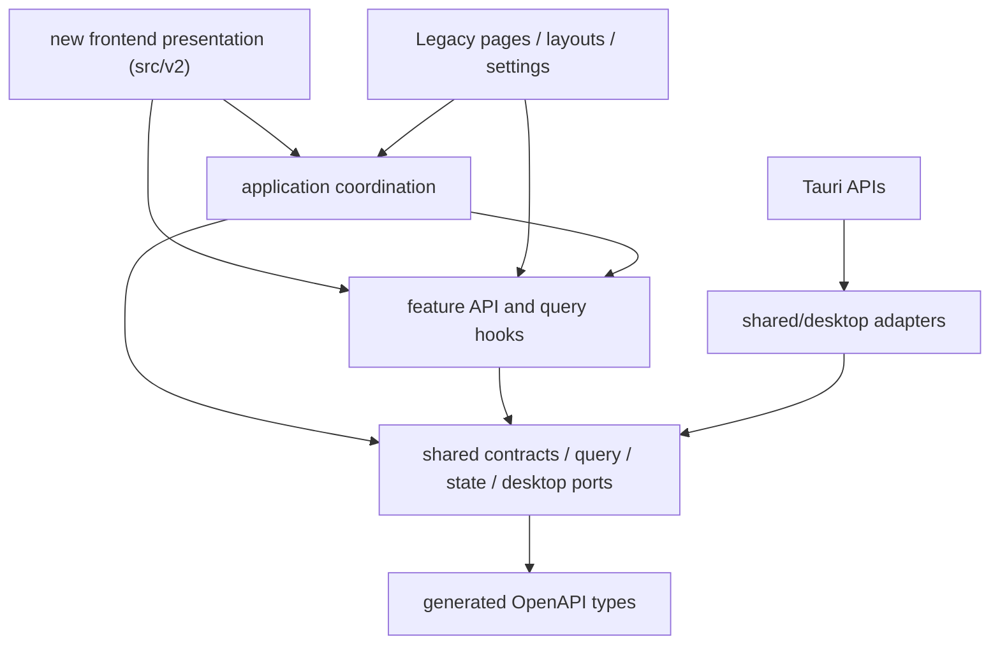

# 新前端架构边界（代码目录：`src/v2`）

本文只定义代码、运行和协作边界，不定义任何视觉语言。目标是让新前端与 Legacy UI 共享业务能力，
但不共享页面结构、组件体系、主题、CSS 或布局状态。

## 术语与命名

- **新前端**：通过外观设置或显式主题 URL 进入的新一代表现层，可同时容纳多个完整且独立的视觉主题。
- **`src/v2`**：新前端的代码代际目录，只表示依赖边界；不得用 `V2` 代称某个视觉方案。
- **`dial-archive`**：当前默认主题 ID，由已确认的断环档案仪首页与终末地 / 莱茵档案空间演进而来；
  主题私有实现使用 `dial-archive-*` 类名和 `--dial-archive-*` CSS 变量。
- **Legacy**：位于 `frontend/Legacy`、通过 `legacy.html` 访问的旧表现层。

## 双入口策略

- `index.html -> src/main.tsx` 是产品启动入口：无显式 `theme` / `home` 参数时加载 Legacy，携带主题
  参数时加载 `src/frontend-main.tsx`、视觉中立的 `FrontendApp`、数据 Provider、路由与主题宿主。
- `legacy.html -> Legacy/main.tsx` 是稳定的旧界面入口，路径与 HashRouter 可以组合为
  `/legacy.html#/workspace/<project-id>`。
- 只有 `Legacy/main.tsx` 可以加载 `Legacy/styles/global.css`、旧主题初始化与旧界面根组件。
  启动选择器每次只加载一条表现层链路，因此新前端运行时不会继承旧 CSS。
- 两个 HTML 都由 Vite 构建并进入 Tauri 的 `frontendDist`；切换界面体系应执行整页导航，
  不在同一个 DOM 中热切换全局样式。

当前目录边界如下：

```text
frontend/
├─ Legacy/              # 旧页面、布局、设置、主题、UI、样式与 UI 测试
├─ legacy.html          # 稳定兼容入口
└─ src/
   ├─ main.tsx          # 默认加载 Legacy，显式主题参数加载 frontend-main
   ├─ frontend-main.tsx # 新前端挂载、通用 reset 与宿主样式
   ├─ application/      # UI 无关的工作流编排
   ├─ features/         # API 与查询适配
   ├─ shared/           # 契约、状态、格式与通用桌面端口
   └─ v2/
      ├─ app/                       # Provider、稳定路由、主题装配与运行时恢复
      ├─ navigation/                # 跨主题稳定的信息架构
      ├─ pages/spaces/              # 视觉中立的空间视图模型与业务控制器
      ├─ themes/
      │  ├─ themeRegistry.ts        # 自动发现完整主题包
      │  ├─ themeTypes.ts           # 主题页面插槽与语义动作契约
      │  └─ <theme-id>/             # 首页、空间页、私有组件、样式、动效与资产
      └─ styles/                    # 仅含中立 reset 与宿主状态样式
```

## 完整主题边界

`src/v2` 只表示新一代前端代码边界，不代表任何具体视觉语言。当前默认主题 `dial-archive` 的组件、
`dial-archive-*` 类名、`--dial-archive-*` 令牌、动效与测试全部位于
`v2/themes/dial-archive/`。终末地 / 莱茵风格不得进入 `v2/app`、`v2/navigation`、`v2/pages` 或
`v2/styles` 的中立代码。

其它模型或设计方向在 `themes/<theme-id>/index.tsx` 导出 `HomePage` 与 `SpacePage` 两个命名页面插槽，
由主题注册表自动发现，不需要共同修改中央视觉清单。`theme-id` 只允许小写字母、数字和连字符。使用
`/?theme=<theme-id>` 独立加载和比较；未知 ID 回退到默认主题。旧的 `?home=` 参数只保留兼容读取，
新链接不得继续生成它。

当前默认 ID 是 `dial-archive`，但“当前默认”不代表“通用模板”。改变
`DEFAULT_FRONTEND_THEME_ID` 属于共享产品决策，应与某个主题的视觉实现分开评审和提交。通用宿主只负责
Provider、加载、错误恢复与稳定信息架构，不提供配色、字体、几何或动效主题。

主题组件不得自行读取 URL、调用 React Router、查询 API、选择本地文件夹或操作跨页面 Store。首页通过
`onEnterSpace(spaceId)` 交还语义意图；空间页通过 `onNavigateSpace(spaceId)` 与
`onReturnHome(spaceId)` 交还导航意图。项目档案的数据查询和桌面动作由
`pages/spaces/archive/useArchiveSpaceController.ts` 完成，再以 `ArchiveSpaceContent` 视图模型注入主题。
数据整备同理由 `pages/spaces/preparation/` 将二级调度页和三级任务工作间所需的真实项目、预演、执行、
操作记录与确认动作投影成中立内容模型。这样更换主题不会复制业务调用，也不会让路由层依赖某个主题的动效。

### `dial-archive` 正式实现边界

当前默认主题已由独立 HTML 探索稿迁移到 `themes/dial-archive/`：`home/` 保存断环首页，`spaces/`
保存六空间共用骨架、项目档案页以及数据整备的二级调度页与三级任务画布。主题根目录的
`components/`、`hooks/`、`model/`、`styles/` 和 `assets/` 只存放首页与空间页已经共同使用的真实主题能力。
详细所有权和变更规则见主题目录自己的 `README.md`。

圆环目标对指针即时响应，内容区使用 56 ms 意图门槛并只提交最后稳定项。键盘焦点和锁定不经过门槛；
外环与内校准环共享动力但使用不同惯性。逐帧运动不得进入 React 状态，左侧固定语义按钮仍是唯一的悬停
预览命中层。方案使用固定参考画布等比适配，不得把它的几何数值或字体提升到视觉中立的 `v2/styles/`。

`FrontendRoutes.tsx` 消费 `navigation/spaceRegistry.ts` 的稳定路径：首页只负责选择空间并播放离场，
路由完成后由同一主题的空间页接手。项目档案使用真实最近工作区数据；数据整备已接入真实项目、素材样本、
预演、执行计划、任务进度与安全恢复能力；03–06 在各自业务控制器完成前只呈现主题内的明确待接入页，
不伪造任务或项目数据。Legacy 由默认启动入口或独立 `legacy.html` 访问；主题不得为了临时可用而内嵌旧页面。

### URL 项目上下文

新前端使用 `project=<project-id>` 表达跨空间共享的当前项目上下文。例如：

```text
/archive?theme=dial-archive&project=<project-id>
/preparation?theme=dial-archive&project=<project-id>
/preparation/workbench?theme=dial-archive&project=<project-id>&focus=<node-id>
/preparation/workbench?theme=dial-archive&project=<project-id>&operation=<operation-id>
```

`v2/app/useProjectRouteContext.ts` 是 URL 与 `workspaceSelectionStore` 之间唯一的同步边界：URL 是新前端的
规范来源，刷新以及浏览器前进 / 后退后都会恢复共享 Store；在项目档案中登记、装载或移除当前项目时，
业务控制器只发出项目变化语义，由路由层更新查询参数。首页进入空间、六空间互相切换、返回首页和未知路径
恢复都会保留合法项目上下文。项目 ID 只接受有界的路由安全字符，非法值不会进入 Store 或后续 API 路径。

主题仍然不知道 `project`、`focus` 或 `operation` 查询参数，也不得读取 Router、Location 或 Store。
空间业务控制器由中立路由层接收当前项目 ID 和变化回调，再把主题需要的数据与动作组装成视图模型。
`/preparation/workbench` 是已建立的首个三级工作间：`focus` 只表达稳定节点入口，`operation` 只表达真实
预处理操作 ID；两者都经过有界路由标识校验，并继续沿用同一项目上下文。主题只能发出“打开工作间”、
“选择操作”和“返回空间”等语义动作，不得在内部另建 URL 或项目会话状态。

## 多模型文件所有权

每个视觉主题只拥有自己的 `themes/<theme-id>/` 目录。新增主题时应直接建立新目录，不复制或改写现有主题
来伪装成通用基础层。以下文件是共享契约：

- `navigation/spaceRegistry.ts`：一级空间的稳定 ID、名称、顺序与语义。
- `themeTypes.ts`、`themeRegistry.ts`：完整主题发现、页面插槽、选择和回退协议。
- `app/FrontendRoutes.tsx`：URL、主题保持与语义导航交接。
- `pages/spaces/`：空间业务视图模型与控制器；不得出现具体主题样式。
- `app/`、`styles/reset.css`、`styles/shell.css`：视觉中立的入口与恢复层。
- `src/application`、`src/features`、`src/shared`：业务编排、API、状态和桌面端口。
- `frontend/Legacy` 与 `legacy.html`：旧界面的稳定退路。

需要改动共享契约时，必须说明所有受影响主题，并将共享改动与单个主题的视觉改动拆成可独立审阅的
差异。只有出现至少两个已确认的真实使用方后，才从主题页面目录提取主题内共享视觉组件；不得为了假想复用预建
全局组件库、动效层或主题令牌。

## 交互与样式基础规则

- 方案必须拥有唯一根类、类名前缀和 CSS 变量前缀；样式从方案入口导入，不写无范围选择器。
- React 状态可以记录当前预览/选中空间，但悬浮抬升使用原生 `:hover` / `:focus-visible`，不得依赖
  高频 React 重渲染追赶鼠标，也不得让持久 `data-active` 状态维持浮起。
- 可移动卡片必须拆成**固定语义命中层**与**可动视觉层**。承接悬停、点击、焦点和键盘事件的外层
  不得设置位移或裁切；内部视觉层负责 `transform`、`clip-path`、阴影与动效，并使用
  `pointer-events: none`，防止快速扫动时命中区从指针下移走。
- 同类可用入口必须获得一致的瞬时反馈；禁用项不得误触发悬浮线、抬升或可点击光标。
- 方案内 DOM 查询限制在根节点 `ref`，禁止用全局 `document.querySelector` 寻找实例内部元素。
- 指针位置等高频输入通过 `requestAnimationFrame` 合并后写入方案私有 CSS 变量；卸载、离开和失焦时
  必须复位并取消未完成帧。
- 同一主题几何同时驱动节点命中、SVG 路径、镜头焦点或小地图时，必须在主题目录建立纯布局模型作为唯一
  事实源；节点矩形派生中心与端口，路径和投影继续从端口派生，不在 TSX、CSS 和 Hook 中各留一份坐标。
- SVG `defs`、DOM ID 与其它跨实例标识使用 React `useId()` 生成实例唯一前缀。
- 所有动效支持 `prefers-reduced-motion`，且关闭动效后仍保留清楚的焦点、选中和禁用状态。

## 依赖方向



约束由 `frontend/scripts/check-architecture.mjs` 执行：

1. `shared` 不得依赖应用、功能或任何界面层。
2. 一个 `feature` 不得导入另一个 `feature`，也不得依赖主题、弹窗、设置或桌面实现。
3. `application` 只协调功能与共享能力，不得导入 Legacy 或新前端页面。
4. 只有 `src/shared/desktop` 与 Legacy 自己的 `Legacy/shared/desktop` 边界可以直接导入
   `@tauri-apps/*`；新前端只能使用前者。
5. 只有 `shared/api/client.ts` 可以直接调用 `fetch`。
6. 新前端不得导入 `frontend/Legacy` 下的页面、布局、设置、主题、UI 或样式。
7. 所有 TypeScript 内部依赖必须保持无环。
8. `themes/<theme-id>` 不得导入 Router、业务 Feature、Application、查询缓存或 Store；除窗口控制端口外，
   主题只可依赖自己的目录、主题页面契约、稳定空间注册表与视觉中立空间视图模型。主题不得读取
   `window.location` / `document.location`。
9. `v2/pages` 不得反向导入具体主题；数据控制器与视图模型必须可以被任意主题消费。

## API 契约

FastAPI 的 `app.openapi()` 是传输契约的唯一来源：

```text
FastAPI schema
  -> frontend/openapi/openapi.json
  -> shared/api/generated/schema.ts
  -> shared/api/contracts/* compatibility aliases
  -> features/*/api.ts
  -> Legacy UI and new frontend
```

- `pnpm --dir frontend api:generate` 更新 OpenAPI 快照与 TypeScript 类型。
- `pnpm --dir frontend api:check` 只检查漂移，不修改文件，并已进入前端总检查。
- `contracts/*` 保留稳定的前端命名，但响应 DTO 均从生成类型派生，不再重复手写字段。
- `ApiOutput` 将 FastAPI 响应中会被默认序列化的字段递归标为必有；请求模型继续使用
  原始 OpenAPI 可选性。少数 UI 专用输入子集必须以 `Pick` / `Omit` 从生成类型派生。
- `features/*/api.ts` 继续作为语义适配层，页面不得拼接 URL 或供应商请求。

## 查询缓存与工作区投影

所有项目内查询使用统一前缀：

```text
["workspace-data", projectId, scope, ...detail]
```

`shared/query/workspaceQueries.ts` 同时定义 scope、键工厂与业务变更对应的失效集合。例如一次标注写入
会失效标注、历史、调用追踪、Prompt 预览、翻译、素材、工作区摘要和统计；调用方只声明
`annotation-written`，不再跨功能导入八套 query key。

全局资源（预设、Tagger、Tag 词典、系统诊断）保留独立键空间。需要影响所有已打开项目的全局设置，
通过按 scope 的 predicate 失效，而不是依赖某个功能的 `all` 键。

## 桌面能力与共享状态

- 原生窗口、对话框、事件、文件 URL 与 Tauri command 都封装在 `shared/desktop`。
- 安全退出编排位于 `application/useCloseGuard.ts`，依赖任务 API、未保存状态和桌面端口；
  两套 UI 复用同一退出协议。
- 批量素材选择位于 `workspaceSelectionStore.ts`，按项目切换时清空。
- 新前端的当前项目由 URL `project` 参数驱动，`useProjectRouteContext.ts` 将其同步到
  `workspaceSelectionStore.ts`；Store 不再作为 V2 路由恢复的唯一来源。
- 未保存修改位于 `unsavedChangesStore.ts`，不再与旧工作区布局状态共用 Store。
- 新前端可以复用这两个明确的状态能力，也可以在不影响退出协议的前提下为自己的页面建立局部视图状态。

## 已提取的行为控制器

新前端所需的核心工作流已经从 Legacy 页面提取到 `src/application`：

1. `workspace` 负责素材查询、筛选、分页、`selected` / `checked` 双选择、目录切换保护、
   批量标注入口以及可恢复素材删除状态。
2. `annotations` 负责标注草稿、并发保存回包协调、历史恢复、复核、删除、批量操作，
   以及 Tags 与本地词典译文的联合保存。
3. `tags` 负责 Tag 元数据保留、词典与 Tagger 词表补全、重复项处理和来源词库选择；
   Legacy 组件只保留键盘、焦点、字号滚轮和 DOM 选区适配。
4. `translations` 提供翻译对照文档模型、Token 输入投影和跨视图联动状态；滚动高度测量、
   ClipboardEvent 与 CodeMirror 仍由各表现层适配。
5. `jobs`、`preprocessing` 与 `exports` 负责表单状态、请求快照、可执行性判断、任务动作、
   预览指纹、停止/恢复和错误投影。

架构检查额外锁定这些已接入控制器的页面：不得重新直接导入 `features/*/hooks.ts` 或
`features/*/api.ts`。新前端可以复用控制器或其中的纯投影函数，不需要渲染任何旧组件。

`Legacy/layouts/workspace/WorkspaceTopbar`、`NavigationRail`、旧设置中心和旧主题系统继续属于 Legacy
表现层。除非某段行为确实需要被新前端复用，否则不为了“代码整洁”继续重构它们；这样可以避免把旧布局
抽象成新体系的隐性框架。

## 其他模型接手顺序

1. 先阅读本文、`themes/README.md`、`spaceRegistry.ts` 和当前主题目录，不从 Legacy 页面猜测新前端
   信息架构。
2. 执行 `git status --short`，确认工作区中已有修改的所有权；不得覆盖其它模型或用户的未提交文件。
3. 为新设计分配唯一 `theme-id`，只新增 `themes/<theme-id>/`，通过
   `/?theme=<theme-id>` 预览。不要先改默认 ID，也不要删除其它主题。
4. 在主题目录内完成首页、空间页、私有组件、Hooks、样式、动效和测试；只有确定缺失共享业务能力时，才提出
   独立的共享契约改动。
5. 先运行主题范围测试和真实交互检查，再运行全量前端门槛。JSDOM 行为测试不能替代浏览器中的
   `:hover` 命中、裁切、层叠和动效验证。
6. 交接时明确记录主题 ID、预览 URL、修改文件、共享契约改动、已运行检查、已知问题和是否已提交；
   不以“测试通过”代替视觉结论。

## 合入门槛

开发中优先运行范围检查：

- `pnpm --dir frontend exec vitest run src/v2`
- `pnpm --dir frontend check:architecture`
- `pnpm --dir frontend exec tsc -b --pretty false`

交付或提交前至少通过：

- `pnpm --dir frontend api:check`
- `pnpm --dir frontend check:architecture`
- `pnpm --dir frontend check`
- `pnpm --dir frontend build`
- `git diff --check`

当抽取涉及桌面生命周期或后端契约时，再追加 Rust 与后端对应测试；纯表现层不得反向要求后端改动。
视觉主题还必须在目标分辨率中检查默认、悬停、键盘焦点、减少动态和快速跨模块扫动；截图、临时浏览器
配置和构建产物不得提交。
