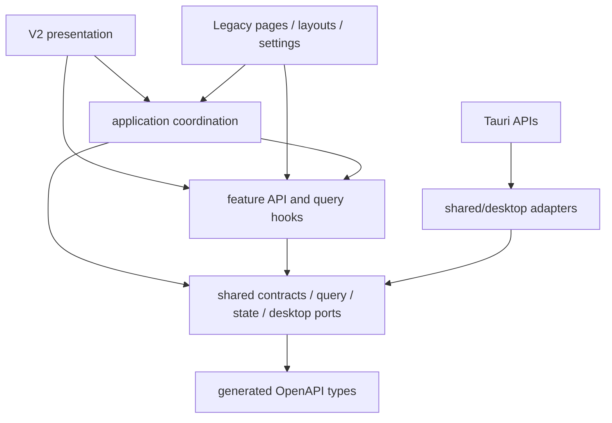

# 前端 V2 架构边界

本文只定义代码与运行边界，不定义 V2 的视觉语言。目标是让全新界面与 Legacy UI 共享业务能力，
但不共享页面结构、组件体系、主题、CSS 或布局状态。

## 双入口策略

- `index.html -> src/main.tsx` 是产品默认入口。V2 开始开发前，它暂时转交给 Legacy 入口；
  V2 可用后只需把这里切换到 `v2-main.tsx`。
- `legacy.html -> src/legacy-main.tsx` 是稳定的旧界面入口，路径与 HashRouter 可以组合为
  `/legacy.html#/workspace/<project-id>`。
- 只有 `legacy-main.tsx` 可以加载 `styles/global.css`、旧主题初始化与旧界面根组件。
  V2 入口不得导入这条链，因此构建时不会继承旧 CSS。
- 两个 HTML 都由 Vite 构建并进入 Tauri 的 `frontendDist`；切换界面体系应执行整页导航，
  不在同一个 DOM 中热切换全局样式。

## 依赖方向



约束由 `frontend/scripts/check-architecture.mjs` 执行：

1. `shared` 不得依赖应用、功能或任何界面层。
2. 一个 `feature` 不得导入另一个 `feature`，也不得依赖主题、弹窗、设置或桌面实现。
3. `application` 只协调功能与共享能力，不得导入 Legacy 或 V2 页面。
4. 只有 `shared/desktop` 可以直接导入 `@tauri-apps/*`。
5. 只有 `shared/api/client.ts` 可以直接调用 `fetch`。
6. V2 不得导入 `pages`、`layouts`、`legacy`、旧 `app/settings`、`shared/ui`、
   `shared/theme` 或 `shared/settings`。
7. 所有 TypeScript 内部依赖必须保持无环。

## API 契约

FastAPI 的 `app.openapi()` 是传输契约的唯一来源：

```text
FastAPI schema
  -> frontend/openapi/openapi.json
  -> shared/api/generated/schema.ts
  -> shared/api/contracts/* compatibility aliases
  -> features/*/api.ts
  -> Legacy UI and V2 UI
```

- `pnpm --dir frontend api:generate` 更新 OpenAPI 快照与 TypeScript 类型。
- `pnpm --dir frontend api:check` 只检查漂移，不修改文件，并已进入前端总检查。
- `contracts/*` 保留稳定的前端命名，但响应 DTO 均从生成类型派生，不再重复手写字段。
- `ApiOutput` 将 FastAPI 响应中会被默认序列化的字段递归标为必有；请求模型继续使用
  原始 OpenAPI 可选性。少数 UI 专用输入子集必须以 `Pick` / `Omit` 从生成类型派生。
- `features/*/api.ts` 继续作为语义适配层，页面不得拼接 URL 或供应商请求。

## 查询缓存与工作区投影

所有项目内查询使用统一前缀：

```text
["workspace-data", projectId, scope, ...detail]
```

`shared/query/workspaceQueries.ts` 同时定义 scope、键工厂与业务变更对应的失效集合。例如一次标注写入
会失效标注、历史、调用追踪、Prompt 预览、翻译、素材、工作区摘要和统计；调用方只声明
`annotation-written`，不再跨功能导入八套 query key。

全局资源（预设、Tagger、Tag 词典、系统诊断）保留独立键空间。需要影响所有已打开项目的全局设置，
通过按 scope 的 predicate 失效，而不是依赖某个功能的 `all` 键。

## 桌面能力与共享状态

- 原生窗口、对话框、事件、文件 URL 与 Tauri command 都封装在 `shared/desktop`。
- 安全退出编排位于 `application/useCloseGuard.ts`，依赖任务 API、未保存状态和桌面端口；
  两套 UI 复用同一退出协议。
- 批量素材选择位于 `workspaceSelectionStore.ts`，按项目切换时清空。
- 未保存修改位于 `unsavedChangesStore.ts`，不再与旧工作区布局状态共用 Store。
- V2 可以复用这两个明确的状态能力，也可以在不影响退出协议的前提下为自己的页面建立局部视图状态。

## 已提取的行为控制器

V2 所需的核心工作流已经从 Legacy 页面提取到 `src/application`：

1. `workspace` 负责素材查询、筛选、分页、`selected` / `checked` 双选择、目录切换保护、
   批量标注入口以及可恢复素材删除状态。
2. `annotations` 负责标注草稿、并发保存回包协调、历史恢复、复核、删除、批量操作，
   以及 Tags 与本地词典译文的联合保存。
3. `tags` 负责 Tag 元数据保留、词典与 Tagger 词表补全、重复项处理和来源词库选择；
   Legacy 组件只保留键盘、焦点、字号滚轮和 DOM 选区适配。
4. `translations` 提供翻译对照文档模型、Token 输入投影和跨视图联动状态；滚动高度测量、
   ClipboardEvent 与 CodeMirror 仍由各表现层适配。
5. `jobs`、`preprocessing` 与 `exports` 负责表单状态、请求快照、可执行性判断、任务动作、
   预览指纹、停止/恢复和错误投影。

架构检查额外锁定这些已接入控制器的页面：不得重新直接导入 `features/*/hooks.ts` 或
`features/*/api.ts`。未来 V2 可以复用控制器或其中的纯投影函数，不需要渲染任何旧组件。

`WorkspaceTopbar`、`NavigationRail`、旧设置中心和旧主题系统继续属于 Legacy 表现层。除非某段行为确实
需要被 V2 复用，否则不为了“代码整洁”继续重构它们；这样可以避免把旧布局抽象成新体系的隐性框架。

## 合入门槛

每批无视觉重构至少通过：

- `pnpm --dir frontend api:check`
- `pnpm --dir frontend check:architecture`
- `pnpm --dir frontend check`
- `pnpm --dir frontend build`

当抽取涉及桌面生命周期或后端契约时，再追加 Rust 与后端对应测试；纯表现层不得反向要求后端改动。
